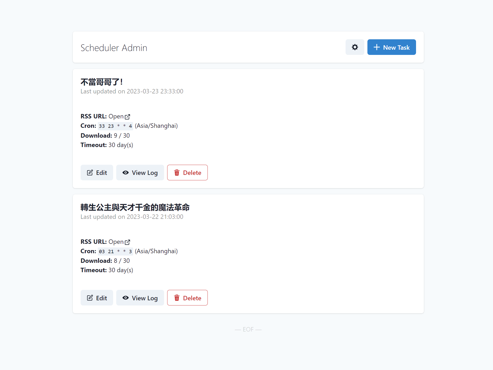
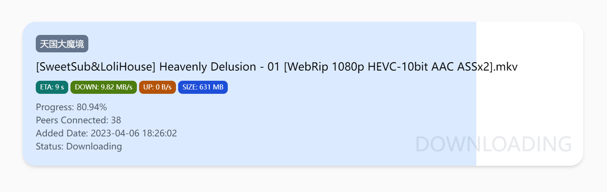

# NyaaHub

Automatically retrieve updates from nyaa.si, and download & upload for you.

## Admin

A basic panel to add / delete / edit tasks.

  

## Fetcher

Fetcher downloads & uploads magnets given by scheduler.

To configure, copy `.env.template` to `.env`. Or set environmental variables directly.

_`rclone` and `transmission` need to be installed._

## Scheduler

Scheduler manages tasks, and retrieves updates from nyaa.si.

To configure, copy `.env.template` to `.env`. Or set environmental variables directly.

`FETCHER_CONFIG` means `<Fetcher API URL>|<Fetcher API Token>`.

## Monitor

Monitor shows downloading & uploading list of fetcher.

  

To configure, set environmental variables `FETCHER_API` to Fetcher API URL.

## Watch Them Online?

Use index application of your cloud storage service.

For OneDrive, use the [onedrive-vercel-index](https://github.com/spencerwooo/onedrive-vercel-index) or its [modified version](https://github.com/Zhousiru/onedrive-vercel-index-mod) by me.
